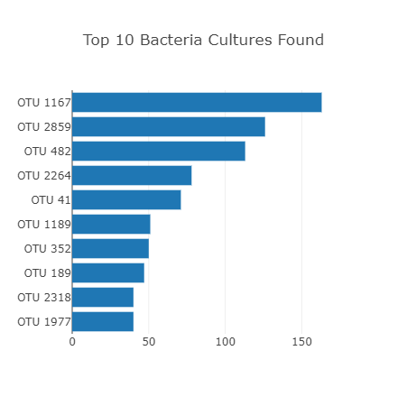
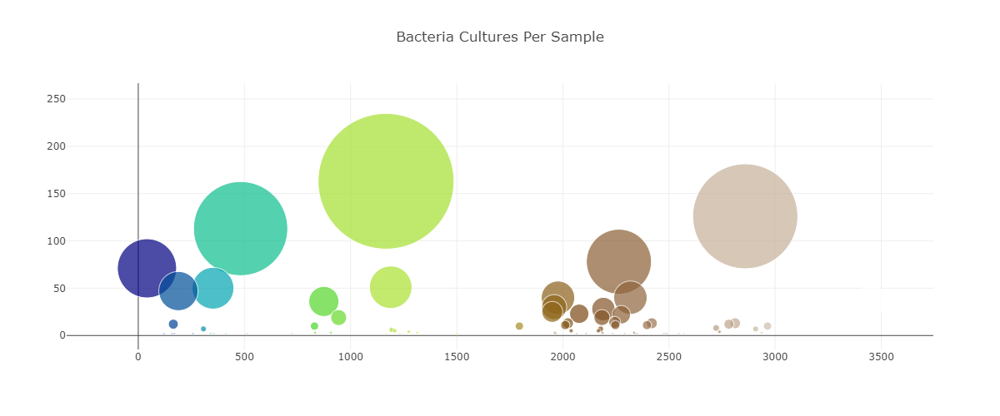

# Belly Button Biodiversity

## Project Overview
The purpose of this project was to build an interactive dashboard to visualize the bacterial data for each volunteer. The volunteers need to be able to easily identify the top 10 bactierial species in their belly buttons. If and when Imporbably Beef identifies a species of bacterial that is a good candidate to manufacture sythetic beef, the volunteers will be able to identify whether that species is found in their own belly button.

## Resources
- **Data Source**: samples.json
- **Languages**: HTML, JavaScript, CSS

## Results

>This above chart shows the volunteers the top 10 bacteria in their belly button

>This above chart shows the volunteers all of the bacteria species that are in their belly button

>This above chart shows the frequency in which the volunteers scrub their belly buttons. This will give the volunteer and idea if the amount their wash their belly button is proportional to the quantity and variety of the bacteria found.
